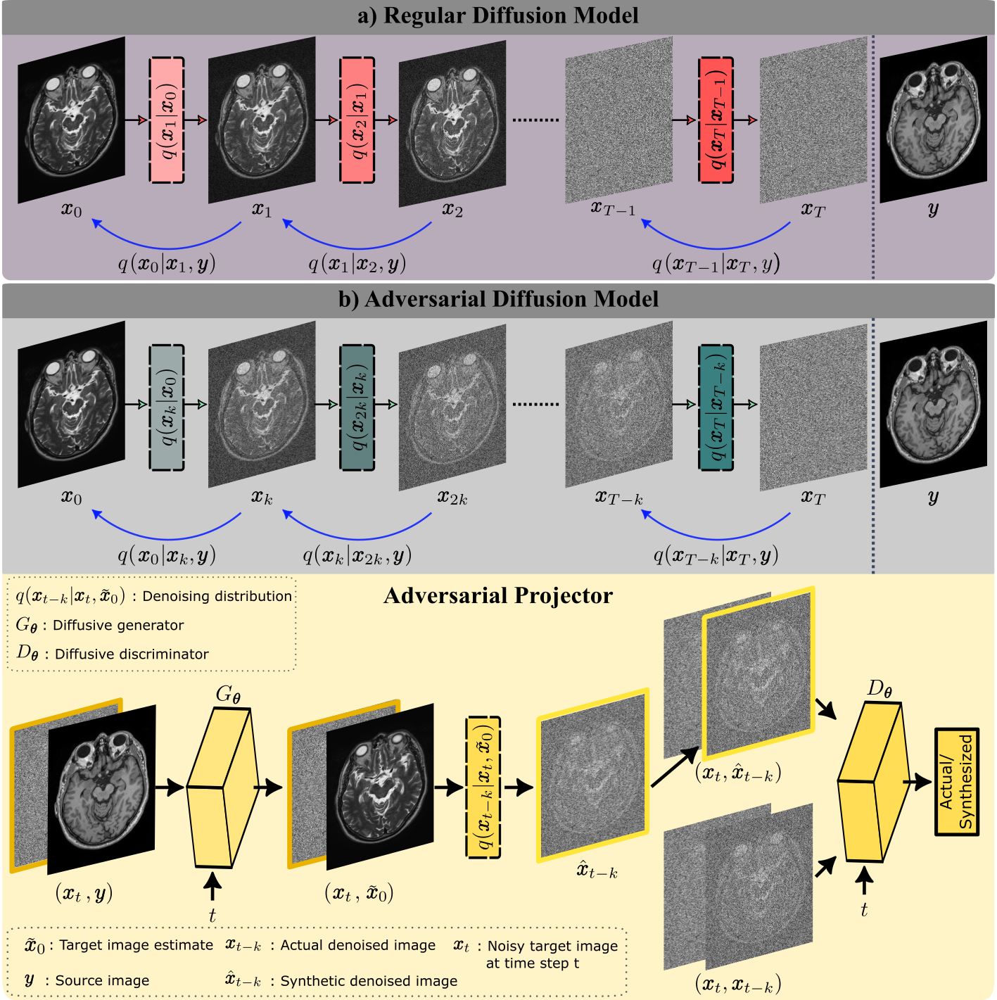
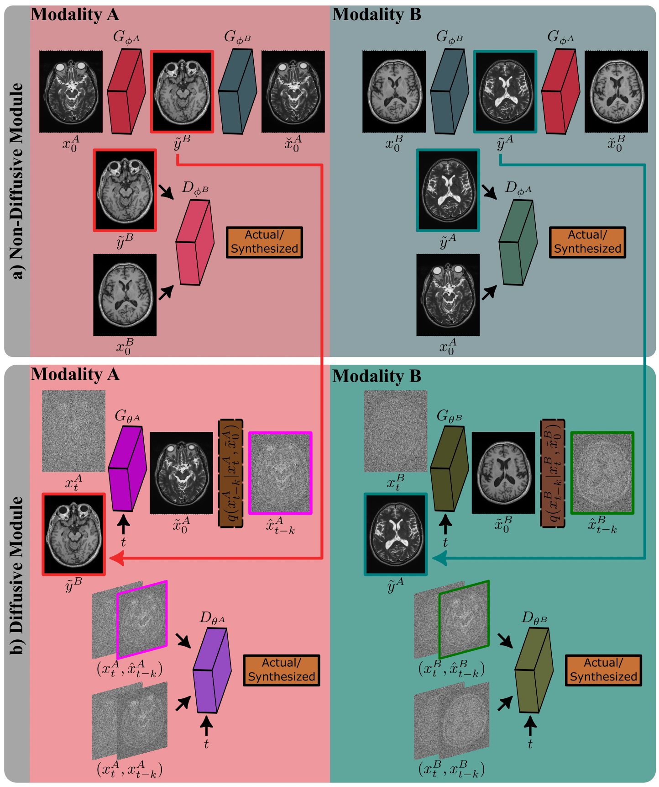

# SynDiff

Official PyTorch implementation of SynDiff described in the [paper](https://arxiv.org/abs/2207.08208).

Muzaffer Özbey, Onat Dalmaz, Salman UH Dar, Hasan A Bedel, Şaban Özturk, Alper Güngör, Tolga Çukur, "Unsupervised Medical Image Translation with Adversarial Diffusion Models", arXiv 2022.





## Dependencies

```
python>=3.6.9
torch>=1.7.1
torchvision>=0.8.2
cuda=>11.2
ninja
python3.x-dev (apt install, x should match your python3 version, ex: 3.8)
```

## Installation
- Clone this repo:
```bash
git clone https://github.com/icon-lab/SynDiff
cd SynDiff
```

## Dataset
You should structure your aligned dataset in the following way:


```
input_path/
  ├── data_train_contrast1.mat
  ├── data_train_contrast2.mat
  ├── data_val_contrast1.mat
  ├── data_val_contrast2.mat
  ├── data_test_contrast1.mat
  ├── data_test_contrast2.mat
```

where .mat files has shape of (#images, width, height) and image values are between 0 and 1.0. 
### Sample Data
Sample toy data can also found under 'SynDiff_sample_data' folder of the repository. 


## Train

<br />

```
python3 train.py --image_size 256 --exp exp_syndiff --num_channels 2 --num_channels_dae 64 --ch_mult 1 1 2 2 4 4 --num_timesteps 4 --num_res_blocks 2 --batch_size 1 --contrast1 T1 --contrast2 T2 --num_epoch 500 --ngf 64 --embedding_type positional --use_ema --ema_decay 0.999 --r1_gamma 1. --z_emb_dim 256 --lr_d 1e-4 --lr_g 1.6e-4 --lazy_reg 10 --num_process_per_node 1 --save_content --local_rank 0 --input_path /input/path/for/data --output_path /output/for/results
```

<br />

## Pretrained Models
We have released pretrained diffusive generators for [T1->PD and PD->T1](https://drive.google.com/file/d/1Hfvnz29NaTFqPMX6RGaEv4Qnt8HeoxZz/view?usp=sharing) tasks in IXI and [T1->T2 and T2->T1](https://drive.google.com/file/d/1zGzZPVY-Xp2Flc7GicOD7s4taxcjwCsn/view?usp=sharing) tasks in BRATS datasets. You can save these weights in relevant checkpoints folder and perform inference.

## Test

<br />

```
python test.py --image_size 256 --exp exp_syndiff --num_channels 2 --num_channels_dae 64 --ch_mult 1 1 2 2 4 4 --num_timesteps 4 --num_res_blocks 2 --batch_size 1 --embedding_type positional  --z_emb_dim 256 --contrast1 T1  --contrast2 T2 --which_epoch 50 --gpu_chose 0 --input_path /input/path/for/data --output_path /output/for/results
```

<br />
<br />


# Citation
Preliminary versions of SynDiff are presented in [NeurIPS Medical Imaging Meets](https://www.cse.cuhk.edu.hk/~qdou/public/medneurips2022/105.pdf) and IEEE ISBI 2023.
You are encouraged to modify/distribute this code. However, please acknowledge this code and cite the paper appropriately.
```
@misc{özbey2023unsupervised,
      title={Unsupervised Medical Image Translation with Adversarial Diffusion Models}, 
      author={Muzaffer Özbey and Onat Dalmaz and Salman UH Dar and Hasan A Bedel and Şaban Özturk and Alper Güngör and Tolga Çukur},
      year={2023},
      eprint={2207.08208},
      archivePrefix={arXiv},
      primaryClass={eess.IV}
}

```
For any questions, comments and contributions, please contact Muzaffer Özbey (muzafferozbey94[at]gmail.com ) <br />

(c) ICON Lab 2022

<br />

# Acknowledgements

This code uses libraries from, [pGAN](https://github.com/icon-lab/pGAN-cGAN), [StyleGAN-2](https://github.com/NVlabs/stylegan2), and [DD-GAN](https://github.com/NVlabs/denoising-diffusion-gan) repositories.
